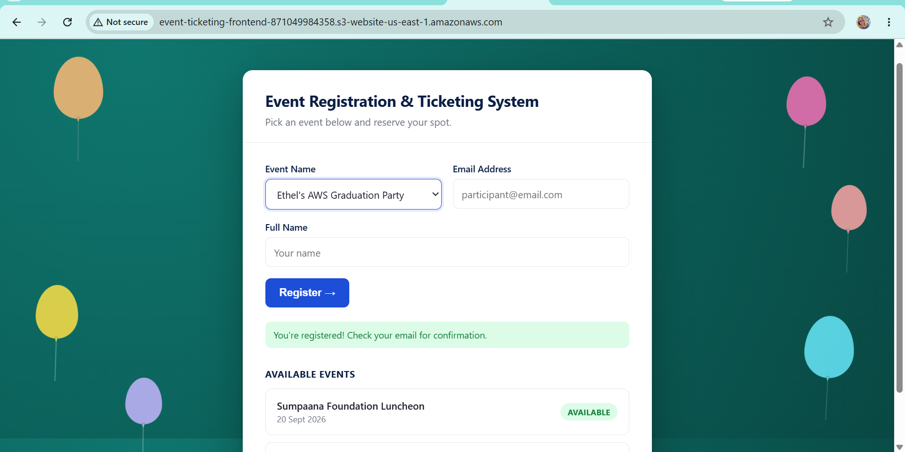

# Event Registration & Ticketing System

A serverless REST API and web application for event registration and ticketing, built entirely on AWS. Replaces manual Microsoft Forms + Excel tracking with a scalable, automated, infrastructure-as-code system.

**Live site:** http://event-ticketing-frontend-871049984358.s3-website-us-east-1.amazonaws.com
**Live API:** https://yibiebjui9.execute-api.us-east-1.amazonaws.com/dev/events

Built as a capstone project for the Azubi Africa AWS Cloud Infrastructure Programme.

---

## Overview

This project lets organizers publish events and lets participants register for them through a simple web form. Every piece of infrastructure — from the database to the API to the frontend hosting — is provisioned and version-controlled with Terraform, and deployments are automated through a GitHub Actions CI/CD pipeline.

---

## Architecture